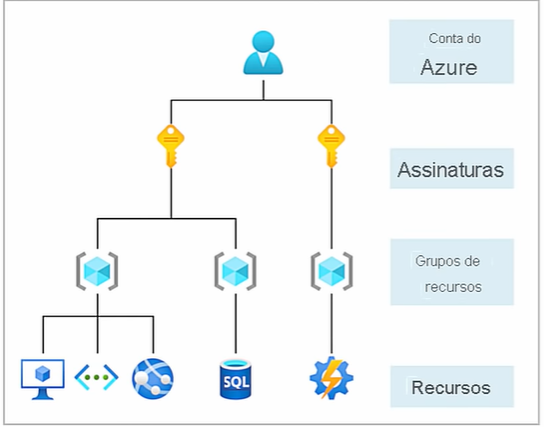
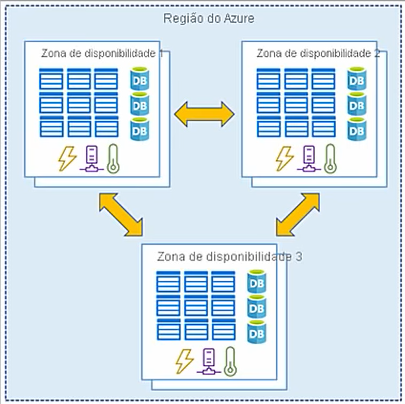

# Certificação AZ 900! Revisão e simulado para prova | Cloud Hero

- [Link para o video!](https://www.youtube.com/watch?v=YjMSGV9YQSA)

## O que estudar

1. [Conceitos de nuvem](#conceitos-de-nuvem) (20%-25%)
2. [Principais serviços](#principais-serviços)(15%-20%)
3. [Principais soluções e ferramentas de gerenciamento](#principais-soluções-e-ferramentas-de-gerenciamento)(10%-15%)
4. [Segurança Geral e os recursos de segurança da rede](#segurança-geral-e-os-recursos-de-segurança-da-rede) (10%-15%)
5. [Recursos de Identidade, governança privacidade e conformidade](#recursos-de-identidade-governança-privacidade-e-conformidade)(15%-20%)
6. [Gerenciamento de custo e acordos de nivel de serviço do Azure](#gerenciamento-de-custo-e-acordos-de-nivel-de-serviço-do-azure) (10-15%)

## Conceitos de Nuvem

- **O que é a computação em nuvem?**

  - São serviços contratados pela internet como servidores, armazenamentos, base de dados, redes e softwares, tudo isso altamente escalonaveis.

- **Porque a computação em nuvem normalmente é mais barata?**

  - Normalmente pagamos apenas pelo serviços, e isso ajuda a:
    - Reduzir custos operacionais.
    - Executar a infraestrutura com eficiência.
    - Escale as operação de acordo com as necessidades de cada négocio.

- **O quê é o Azure?**

  - Azure é um conjunto de serviços de nuvem.

  - Fornece mais de 100 serviços, desde um *storage account* para armanezar dados até um *Web App*.

  - A principal vantagem é a integração entre serviços ser mais simples por ser Microsoft.
  
- **O quê é o Azure?**
  
  - Um portal unificado baseado na Web para gerenciar e monitorar todos os recursos que você provisinou.
  
- **O quê é o Azure Marketplace?**
  
  - Conectar os usuários a parceiros da Microsoft, um portal de venda como o Google Play ou Galaxy Store
  
- **Serviços do Azure mais utilizados:**

  - Computação
  - Rede
  - Armazenamento
  - Móvel
  - Bancos de dados
  - Web
  - Internet das coisas(Iot)
  - Big data
  - IA
  - DevOps

- **Contas do Azure:**
  
  - Contas podem conter varias assinaturas, e os recuros podem ser criados dentro dessas assinaturas.

  - Assinaturas são uteis para separar custos.
  
    

- **Quais são os tipos de nuvens:**

  - **Nuvem pública:**
    - São serviços destinados a qualquer pessoa que deseja comprá-los. Ou seja são de um provedor como a *Azure*, *AWS*, *Google Plataform* e entre outros.
    - Recursos podem ser provisionados rapidamente.
    - Geralmente pagam pelo o que utilizam.
  - **Nuvem privada:**
    - São recursos utilizados somente por usuarios de determinada empresa ou organização.
    - O Hardware é de responsabilidade da organização.
    - A empresa tem total controle sobre a manuntenção, atualização e segurança do Software.
  - **Nuvem híbrida:**
    - É uma combinação das duas nuvens anteriores, permitindo que dados e aplicativos sejam compartilhados entre elas.
    - Fornece maior flexibilidade
    - As organizações controlam a segurança, a conformaidade ou os requisitos legais.
    - As organizações determinam onde executar seus aplicativos.

- **Regiões do Azure**
  - É uma área geográfica com pelomenos um data center conectado a uma rede de baixa latencia.

  - Sempre criar um recurso balanceando custo com latencia.

- **O que é uma zona de disponibilidade?**
  
  - Datacenters separados fisicamente dentro da mesma região, como se a região fosse "Brazilsouth" e tivesse um datacenter no Rio de janeiro e um em São Paulo.

    

## Principais Serviços

- **O que é a Rede Virtual?**
  - Permitem que os recursos do Azure se comuniquem-se uns com os outros, com usuarios na internet e mais. Oferecem:
    - Isolamento e segmentação.
    - Comunicação pela internet.
    - Comunicação entre recursos Azure.
    - Comunicação com os recursos locais.
    - Rotear tráfego de rede.
    - Filtrar tráfego de rede.
    - Conectar redes virtuais.
  - UDR ou Rotas definidas pelo Usuario é roteamento definido pelo usuario, que é uma grande atualização das Redes virtuais, porque possibilita o maior controle sobre o tráfego da rede.
  - Pode ter proteção contra DDos.

  - Gateway VPN
    - Permite a conexão de datacenters locais a redes virtuais por uma conexão site a site.
    - Permite a conexão de dispositivos individuais a redes virtuais por uma conexão ponto a site.
    - Permite a conexão de Rede Virtual a outra redes virtuais por uma conexão rede a rede.
  - VPN baseado em Rota
    - Usa um Gateway VPN baseado na rota.

- **Serviço de Armazenamento**
  - Vantagens:
    - Alta disponibilidade
    - Segurança
    - Escalonaveis
    - Gerenciados pela microsoft
  - Serviços:
    - *Azure Blobs:* Repositorio para texto e dados binários. Tem suporte para análise de Big Data.
    - *Azure Files:* Compartilhamento de arquivos gerenciados para implantações locais e em Nuvem.
    - *Azure Queues:* Um armazenamento de mensagens para um sistema de mensagens confiável entre componentes do aplicativo.
    - *Azure Tables:* Um armazenamento NoSQL para guardar dados sem esquema de estruturação.
    - *Azure Disks:* Volumes de armazenamento em nível de bloco para VMs do Azure.

## Principais soluções e ferramentas de gerenciamento

- **Inteligência e Internet das Coisas**
  - Sensores ambientais
  - Código de barras, QRcode
  - Sensor de proximidade e localização
  - Sensores de infravermelho, de luz e cor, ultravioleta e mais.

- **Azure PowerShell ou Azure CLI**
  - Automatização de rotinas, provisionamento.

- **Azure Monitor**
  -  Azure Monitor é uma plataforma de coleta e analise de logs e métricas do ambiente Azure e Local
- **Integridade do Serviço**
  - Uma plataforma para ajudar com eventos que podem gerar impactos no serviço, como manutenção planejada ou instabilidade do serviço 

## Segurança Geral e os recursos de segurança da rede

- **Central de Segurança do Azure/Microsoft Defender para Nuvem**

  - É um serviço de monitoramento que da visibilidade a segurança em todos os serviços, tanto no Azure, quanto localmente, ele pode:
    - Monitorar as configurações de segurança das cargas de trabalho.
    - Aplicar as configurações obrigatoria a novos recursos.
    - Recomendar configurações basicas de segurança da rede e recursos.
    - É possivel trazer a % de segurança de acordo com alguns complaice.

- **Azure Sentinel**
  - Sistema SIEM(Centralizador de Log's)
  - Permite coletar dados de nuvem em escala.
  - Detectar ameaças não detectadas anteriormente.
  - Investigar ameaças com inteligencia artificial.
  - Responder a incidentes rapidamente.
  - Integra com varias nuvens.

- **Azure Key Valut**
  - É um serviço que centraliza o armazenamento de chaves e segredos em um só lugar.

- **Defesa em profundidade**
  - É um conjunto de camadas de proteção com os dados no centro.
  - Segurança fisica é a primeira camada para proteger o hardware.
    

- **Firewall do Azure**
  - Conceitos de Firewall comum

- **Ataque DDOS**
  - É o ataque mais comum entre os recursos Azure, que é o de negação de serviço.

- **Grupo de Segurança de Rede do Azure**
  - Permite filtrar tráfego de rede proveniente dos recursos 

## Recursos de Identidade, governança privacidade e conformidade:

- **O Que é MFA**
  
  - Autenticação de Multifator, é um segundo elemento, fora a senha, que é realmente o usuario que esta acessando.
  - Esses elementos se enquandram em 3 categorias:
    - Algo que o usuario sabe: Email e senha.
    - Algo que o usuario tem: Um código enviado para o telefone.
    - Algo que o usuario é: Biometrica ou detecção facial.

- **Acesso condicional**
  - É uma ferramenta do Azure AD que permite ou nega o acesso ao recurso com base em sinais de identidade. 
  - Como bloquear com a condição de ele esta no escritorio.

- **Microsoft Active Directory**
  - Serviço de identidade dos usuários
  - Logon unico em varias plataformas
  
- **Conceito de RBAC**
  - O minimo de privilegio possivel para o colaborador trabalhar.

- **Locks**
  - Existem 2 tipos o de bloquear exclus~pes e o de somente leitura.

## Gerenciamento de custo e acordos de nivel de serviço do Azure

- **Calculadora da Azure**
  - Calcula o preço do recurso que vai gastar.
- **Tipos de assinatura**
  - Assinatura gratuitra.
  - Pago pelo Uso (Pay-as-Ago)
  - Ofertas de Membro

- **Assistente do Azure para monitorar gastos**
